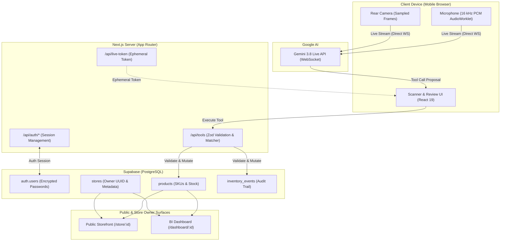
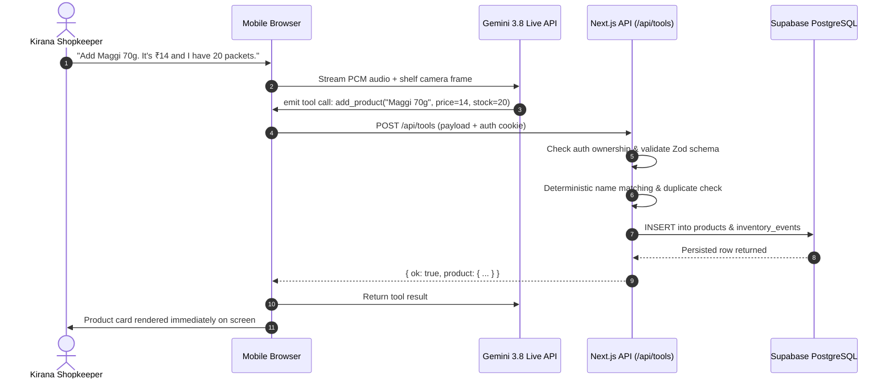
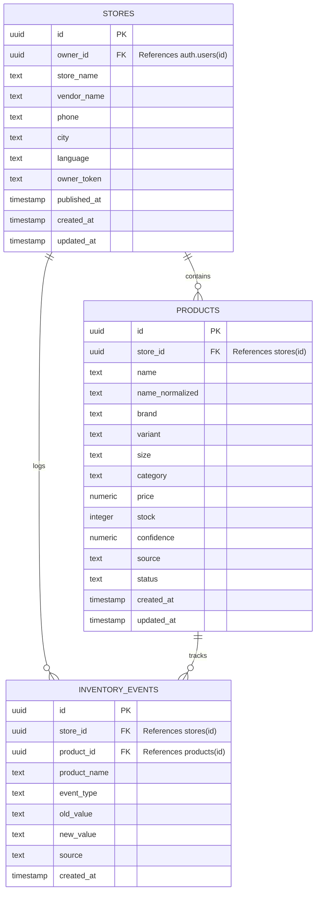

# Stockeye

<div align="center">

**Real-time AI store assistant for small Indian retailers.**  
*Show your shop. Talk naturally. Stockeye understands the rest.*

<!-- TODO: add live demo link -->
<!-- TODO: add demo video link -->

[](https://nextjs.org/)
[](https://react.dev/)
[](https://www.typescriptlang.org/)
[](https://tailwindcss.com/)
[](https://ai.google.dev/)
[](https://supabase.com/)
[](LICENSE)

</div>

---

## Table of Contents

- [Overview](#overview)
- [The Problem & The Stockeye Approach](#the-problem--the-stockeye-approach)
- [What Stockeye Does](#what-stockeye-does)
- [How It Works (Scan Walkthrough)](#how-it-works-scan-walkthrough)
- [Product Lifecycle](#product-lifecycle)
- [System Architecture](#system-architecture)
- [Data Model & Audit Trail](#data-model--audit-trail)
- [Tech Stack](#tech-stack)
- [Getting Started](#getting-started)
  - [Prerequisites](#prerequisites)
  - [Installation](#installation)
  - [Environment Variables](#environment-variables)
  - [Database Setup](#database-setup)
  - [Running Locally](#running-locally)
- [Trying It Out (Verification Flow)](#trying-it-out-verification-flow)
- [Production Deployment](#production-deployment)
  - [Deploying to Vercel](#deploying-to-vercel)
  - [Supabase Configuration](#supabase-configuration)
- [Implementation Decisions](#implementation-decisions)
- [Limitations & Practical Constraints](#limitations--practical-constraints)
- [Roadmap](#roadmap)
- [License](#license)

---

## Overview

**Stockeye** is an AI assistant built specifically for small Indian retail and kirana shopkeepers who want to digitize their physical store without spending hours typing products into forms or scanning barcodes one by one.

The shopkeeper creates their account and store profile, opens the live scanner on their phone, and points the camera at a shelf while talking naturally:

> *"Add Maggi 70g. It's ₹14 and I have 20 packets."*

Stockeye identifies the product on the shelf, extracts the spoken price and stock quantity, verifies the data through strict server validation, and builds a verified inventory in real time. The same conversational interface serves continuous store operations:

> *"We sold five Maggi."*

Stockeye immediately updates the stock count and records the activity event.

```text
       SHOW                SPEAK                CONFIRM              DONE
┌────────────────┐   ┌────────────────┐   ┌────────────────┐   ┌────────────────┐
│  Point phone   │ → │ "Maggi ₹14,    │ → │ Instant review │ → │ Live digital   │
│   at shelf     │   │  20 packets"   │   │  on screen     │   │  storefront    │
└────────────────┘   └────────────────┘   └────────────────┘   └────────────────┘
```

The resulting store features:
- **Public Customer Storefront** (`/store/[storeId]`): Instant search, categories, live availability, and QR shareability.
- **Private Inventory & BI Dashboard** (`/dashboard/[storeId]`): Total SKU count, stock valuations, low-stock warnings, and activity feeds.
- **Auditable Inventory Ledger**: Every voice or manual modification is recorded as an immutable event.

> **Core Philosophy:** The shopkeeper already knows their business inside out. Stockeye makes the software adapt to the shopkeeper instead of forcing the shopkeeper to learn complex software.

---

## The Problem & The Stockeye Approach

### The Kirana Reality
Small Indian kirana stores carry hundreds of SKUs spanning packaged food, personal care, regional brands, loose goods, and multiple size variants. Turning that shelf inventory into a digital catalogue is notoriously tedious:
- Barcode scanning fails when items are loose, unbarcoded, regional, or damaged.
- Typing names, brands, net weights, prices, and quantities into web forms takes days.
- Catalogue maintenance is neglected because updating forms during busy shop hours is impractical.

### The Contrast

| Traditional Inventory Tools | Stockeye Approach |
| :--- | :--- |
| Scan barcode → Click form → Type name → Enter price → Save | **Point camera → Talk naturally → Confirm** |
| Requires learning complex inventory management software | **Zero learning curve** — software understands natural speech |
| Disconnected from real-time customer visibility | **Instant public storefront** published with a shareable QR code |
| Manual count reconciliation | **Conversational updates** (*"Sold 5 Maggi"*) adjust stock in seconds |

---

## What Stockeye Does

1. **Email & Password Authentication**: Secure store ownership backed by Supabase Auth with encrypted sessions and protected routes.
2. **Multimodal Shelf Understanding**: High-efficiency periodic camera sampling coupled with bidirectional audio via Gemini 3.8 Live.
3. **Natural Voice Interaction**: Speak freely in English, Hindi, or Hinglish without memorizing syntax or command keywords.
4. **Deterministic Server Matching**: Normalizes query strings, handles regional spellings, strips package sizes, and prevents duplicate records.
5. **Proactive Clarification**: If a product label is recognized but the price or stock count wasn't stated, the AI directly asks the shopkeeper instead of hallucinating values.
6. **Review & Publish Gate**: The shopkeeper inspects the proposed catalogue, makes manual adjustments if desired, and publishes when ready.
7. **Post-Publish Inventory Operations**: Voice commands continue to work post-launch for recording sales, restocks, and price updates.

---

## How It Works (Scan Walkthrough)

1. **Account & Store Creation**: The shopkeeper signs in, enters their store name, vendor name, phone number, and preferred language.
2. **Direct Ephemeral Token Minting**: The browser calls `POST /api/live-token`. The server mints a short-lived token using `@google/genai` SDK and returns it to the browser.
3. **Direct WebSocket Connection**: The browser opens a secure WebSocket connection directly to Gemini Live (`wss://generativelanguage.googleapis.com`), bypassing server bottlenecks and minimizing latency.
4. **Multimodal Streaming**: The browser streams 16 kHz PCM microphone audio via an `AudioWorklet` and periodically transmits optimized JPEG shelf frames.
5. **Tool Call Emission**: When Gemini recognizes a product and user intent, it emits a function call (`add_product`, `update_product`, `set_price`, `set_stock`).
6. **Server Validation & Database Persistence**: The browser forwards tool calls to `POST /api/tools`. The server validates payloads with Zod, validates user ownership, applies deterministic matching, and writes records to Supabase PostgreSQL.
7. **Immediate Visual Feedback**: The live scanner UI instantly displays product chips with live confidence badges, prices, and stock indicators.

---

## Product Lifecycle

Every item detected by Stockeye progresses through a strict, transparent lifecycle:

```text
 ┌──────────┐      ┌──────────┐      ┌───────────┐      ┌───────────┐      ┌─────────┐
 │ Detected │  →   │ Proposed │  →   │ Confirmed │  →   │ Published │  →   │ Updated │
 └──────────┘      └──────────┘      └───────────┘      └───────────┘      └─────────┘
  Camera sees       AI proposes       Shopkeeper         Live on public     Ongoing sales
   packaging         tool call         approves           storefront         & restocks
```

> [!IMPORTANT]
> **The AI Proposes — The Server Validates — The Owner Decides.**  
> Gemini never writes directly to the database. The shopkeeper retains full authority over what enters confirmed inventory.

---

## System Architecture

### Component Architecture



### Voice Update Sequence



---

## Data Model & Audit Trail

Stockeye maintains a relational data model with Row Level Security (RLS) enabled on all tables:



- **`stores`**: Represents store profiles and publication timestamps linked to an authenticated Supabase user.
- **`products`**: Maintains validated product entries with normalized names for deterministic fuzzy search.
- **`inventory_events`**: Append-only log recording every addition, edit, price adjustment, and stock sale across all interfaces (`camera`, `voice`, or `manual`).

---

## Tech Stack

| Layer | Technology | Role |
| :--- | :--- | :--- |
| **Framework** | Next.js 16 (App Router) | Server components, route handlers, and SSR |
| **UI Library** | React 19 | State handling, optimistic updates, audio hooks |
| **Language** | TypeScript 5 (Strict) | End-to-end type safety across schemas and routes |
| **Styling** | Tailwind CSS v4 | Responsive utility styles and design tokens |
| **AI Multimodal** | Gemini 3.8 Live API | Real-time speech understanding and visual shelf recognition |
| **AI SDK** | `@google/genai` | Ephemeral token creation and Google AI communication |
| **Database & Auth** | Supabase (PostgreSQL) | Authentication, session cookies, relational storage, and RLS |
| **SSR Auth Client**| `@supabase/ssr` | Cookie-based session tracking and server validation |
| **Validation** | Zod 3 | Runtime validation for all API inputs and tool payloads |
| **Audio Engine** | Web Audio API / AudioWorklet | Low-latency 16 kHz PCM microphone capture and audio streaming |

---

## Getting Started

### Prerequisites
- **Node.js**: v20 or later (v22 recommended)
- **Supabase Account**: With a new or existing PostgreSQL project
- **Google AI Studio Key**: API key with Gemini Live API access

### Installation

```bash
# Clone the repository
git clone https://github.com/Kanneboinashivakumar/Stockeye.git
cd Stockeye

# Install project dependencies
npm install
```

### Environment Variables

Copy the example environment template:

```bash
cp .env.example .env.local
```

Populate `.env.local` with your configuration:

```env
# Gemini API Configuration
GEMINI_API_KEY=your_gemini_api_key_here
GEMINI_LIVE_MODEL=gemini-3.8-live

# Supabase Configuration
NEXT_PUBLIC_SUPABASE_URL=https://your-project.supabase.co
NEXT_PUBLIC_SUPABASE_ANON_KEY=your_supabase_anon_key_here
SUPABASE_SERVICE_ROLE_KEY=your_supabase_service_role_key_here

# App URL & Configuration
NEXT_PUBLIC_APP_URL=http://localhost:3000
LOW_STOCK_THRESHOLD=5
```

> [!CAUTION]
> Never expose `SUPABASE_SERVICE_ROLE_KEY` or `GEMINI_API_KEY` in client-side code or public git commits.

### Database Setup

1. Open your [Supabase Dashboard](https://supabase.com/dashboard) → **SQL Editor**.
2. Run the master schema script located in [`supabase/schema.sql`](supabase/schema.sql).
3. If upgrading an existing database, execute the auth migration script in [`supabase/migration_auth.sql`](supabase/migration_auth.sql).
4. Verify that tables `stores`, `products`, and `inventory_events` exist under **Table Editor**.

### Running Locally

```bash
# Run local development server
npm run dev

# Run unit tests
npm test

# Run TypeScript type check
npm run typecheck

# Build production bundle
npm run build
```

---

## Trying It Out (Verification Flow)

1. **Start the local server**:
   ```bash
   npm run dev
   ```
2. **Open the application**: Navigate to [http://localhost:3000](http://localhost:3000).
3. **Sign In or Register**: Click **Create account** to sign up (or sign in with your credentials).
4. **Onboard Store**: Enter your store name, vendor name, phone number, and preferred language.
5. **Open Live Scanner**: Click **Open Live Scanner** and grant camera & microphone permissions.
6. **Point and Speak**: Aim your rear camera at a product or shelf and speak naturally:
   > *"Add Maggi 70g. Price is 14 rupees. I have 20 packets."*
7. **Inspect Real-time Detection**: The product card appears with price, stock, and live status.
8. **Review Catalogue**: Click **Review Catalogue** to inspect items, adjust quantities, or remove entries.
9. **Publish Store**: Click **Publish Store** to finalize your catalogue.
10. **Verify Outputs**:
    - **Public Storefront** (`/store/[storeId]`): Displays products with search and category filters.
    - **BI Dashboard** (`/dashboard/[storeId]`): Displays inventory valuations, low-stock warnings, and activity audit trails.
11. **Test Conversational Maintenance**: Return to the scanner and say:
    > *"We sold five Maggi."*
    Observe the stock decrement and the newly logged activity event in the dashboard.

---

## Production Deployment

### Deploying to Vercel

1. Push your repository to GitHub.
2. In [Vercel](https://vercel.com/), click **Add New** → **Project** and import `Stockeye`.
3. In **Project Settings**:
   - Ensure **Framework Preset** is set to **`Next.js`**.
   - Keep default build and output settings.
4. Add the following **Environment Variables**:
   - `GEMINI_API_KEY`
   - `GEMINI_LIVE_MODEL` (`gemini-3.8-live`)
   - `NEXT_PUBLIC_SUPABASE_URL`
   - `NEXT_PUBLIC_SUPABASE_ANON_KEY`
   - `SUPABASE_SERVICE_ROLE_KEY`
   - `NEXT_PUBLIC_APP_URL` (`https://your-domain.vercel.app`)
   - `LOW_STOCK_THRESHOLD` (`5`)
5. Click **Deploy**. Vercel will build the Next.js bundle and provision SSL for secure HTTPS camera and microphone streaming.

### Supabase Configuration
- Ensure **Row Level Security (RLS)** remains active on all tables.
- Under **Authentication** → **URL Configuration**, set the **Site URL** and **Redirect URLs** to your production Vercel domain.

---

## Implementation Decisions

### 1. Ephemeral Client Tokens vs. Audio Proxying
Rather than streaming heavy 16 kHz audio and camera frames through a serverless backend proxy, Stockeye mints short-lived ephemeral tokens via `/api/live-token`. The mobile browser connects directly to Gemini Live over WebSocket, minimizing latency and eliminating server CPU bottlenecks while keeping the master `GEMINI_API_KEY` secure.

### 2. Deterministic Matching Pipeline
Shopkeepers often use colloquial names (*"Parle G"*, *"Good Day"*, *"Bournvita"*). Stockeye normalizes product strings by stripping punctuation, extra whitespace, and package sizes (`1kg`, `500g`) before performing tiered lookups (UUID → normalized equality → substring → Levenshtein fuzzy match). Ambiguous candidates trigger clarification prompts rather than incorrect overwrites.

### 3. Null Values Over Speculation
If a product's price or quantity is not explicitly stated by the owner, Stockeye preserves the fields as `null` or asks a targeted follow-up question. The system never speculates or injects placeholder prices.

---

## Limitations & Practical Constraints

- **Camera Sampling**: Frames are sampled at periodic intervals (1 fps) to conserve bandwidth. Fast camera sweeps may miss smaller packaging text.
- **Shelf Crowding**: Densely stacked shelves with partially obscured labels require the shopkeeper to pause momentarily over items.
- **Audio Clutter**: High background noise in busy markets can impact speech transcription. Push-to-talk microphone controls help isolate speech.
- **HTTPS Requirement**: Modern browsers enforce HTTPS for camera and microphone access on remote devices (localhost is exempt for development).

---

## Roadmap

- [ ] **ONDC Integration**: Connect published catalogues to the Open Network for Digital Commerce via seller-side APIs.
- [ ] **Regional Language Expansion**: Extend speech parsing to Telugu, Tamil, Kannada, Marathi, and Bengali.
- [ ] **Offline Queueing**: Cache voice operations locally during network dropouts and sync automatically upon reconnection.
- [ ] **Barcode Fusion**: Combine visual package recognition with instant optical barcode reading for ultra-dense displays.

---

## License

This project is licensed under the [MIT License](LICENSE). Built independently by [Kanneboina Shiva Kumar](https://github.com/Kanneboinashivakumar).
